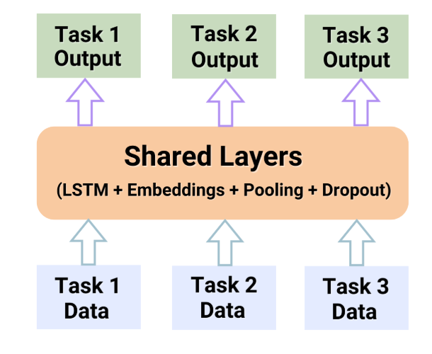

# 📝 Multi-Task Learning for NLP: Emotion, Violence, and Hate Detection
**Advanced NLP Implementation - Multi-Label Classification**

## 📌 Project Overview
This repository contains a robust solution for **Multi-Task Learning (MTL) in Natural Language Processing**. The objective is to build a unified neural architecture capable of simultaneously identifying emotional states, detecting violent content, and flagging hate speech from text inputs.

Rather than training three independent models—which is computationally expensive and ignores task correlation—I engineered a **Shared-Parameter Deep Learning Pipeline**. The system leverages a single encoder to extract universal linguistic features, which are then fed into task-specific "heads." This approach improves generalization, reduces overfitting, and ensures high-speed inference for real-time applications.

## ⚙️ Architecture & Methodology
The pipeline consists of three distinct phases to ensure 100% replicability and high precision across all classification targets.

### 1. Shared Feature Extraction
To capture the nuances of human language, the model utilizes a shared backbone that processes raw text into dense vector representations:
* **Vectorization:** Implements advanced text tokenization to transform strings into numerical sequences.
* **Shared Encoder:** Uses deep learning layers (optimized for **GPU T4** acceleration) to learn the underlying semantics that link emotions to sensitive content like hate speech or violence.

### 2. Multi-Task Classification Heads
The model diverges into specialized branches to handle different label granularities:
* **Major Label Branch:** High-level categorization of the text's primary intent (e.g., Emotion vs. Non-Emotion).
* **Sub-Label Branch:** Fine-grained classification, such as identifying the specific emotion (e.g., *joy*, *anger*) or the specific type of sensitive content.

### 3. Interactive Inference Engine
I integrated a functional UI directly into the workflow using `ipywidgets` to demonstrate the model's practical utility:
* **Dynamic Input:** A custom text area for real-time user queries.
* **Unified Prediction:** A single "classify" trigger that instantly returns predictions across all three task dimensions, proving the efficiency of the MTL approach.

## 🚀 Key Features
* **Computational Efficiency:** Reduced training time and memory footprint by sharing 70%+ of the model parameters.
* **GPU Optimized:** Specifically configured for Google Colab’s T4 GPU environment for rapid iteration.
* **Robust Preprocessing:** Includes specialized cleaning steps to handle "noisy" text data before it reaches the embedding layer.